# Inlog

Parse config files and keep track of your results by creating logfiles!


## Motivation
Imagine, you have a python program with some parameters. You make a few experiments with it, producing some results. Usually, people write the parameters in the filename:
```txt
Result1_day2_3deg_4km.txt
```
There are a few problems with this:

- The filenames get very long with more parameters.
- The list of parameters is often incomplete.
- The list of parameters is not machine readable.

`inlog` ("Input Logger") tries to solve those problems by creating a log file with all parameters next to your results.
Therefore, you need to put your parameters into a separate file, e.g. in yaml or ini format:
Then, it requires just three additional lines in your python code to create a comprehensive logfile:
```python
import inlog
config=inlog.load_yaml('Params.yaml', '1.0')
#do your stuff, using the parameters in config and save into 'Results1.txt'
#...
config.write_log('Results1.txt')
```

But there is more: `inlog` can store additional information like date, runtime or a [hash of your data](#hashes), it can keep track of complex histories of your results and it can even [visualize](#flowchart) them as a flowchart! To see a more comprehensive example, look at the [examples folder](https://github.com/Ockenfuss/inlog/tree/master/examples)

## Installation
The basic version of `inlog` only depends on the python standard library.
```
python3 -m pip install inlog
```
If you want Yaml support, install the `extras` version of `inlog`:
```
python3 -m pip install inlog[extras]
```

## Usage

### Input Parameters
It is not necessary to read input parameters from a separate file. However, in most cases, this is desirable. Inlog supports currently the 'ini', 'json' and '.yaml' file formats. 

#### Ini Format
Parsing is done using the 'configparser' module from the python standard library. ini files consist of sections with options. All options are treated as strings. Ini files allow for value interpolation, see the [manual](https://docs.python.org/3/library/configparser.html#) for further information.
Example of an .ini file:
```ini
[Filepaths_General]
home=/home
bin=/bin
[Filepaths_User]
documents=~/Documents
```

```python
import inlog
config=inlog.load_ini('config.ini',version='1.0')
```

#### JSON Format
Example of a .json file:
```json
{
  "Filepaths": {
    "Common": {
      "home": "/home",
      "bin": "/bin"
    },
    "User": {
      "documents": "~/Documents"
    }
  }
}
```

```python
import inlog
config=inlog.load_json('config.json',version='1.0')
```

#### Yaml Format
Parsing Yaml files requires the `pyyaml` library.
Example of a .yaml file:
```ini
Filepaths:
  Common:
    home: /home
    bin: /bin
  User:
    documents: ~/Documents
```

```python
import inlog
config=inlog.load_yaml('config.yaml',version='1.0')
```

#### Dictionary
You can also pass a dictionary directly to the Logger Class:
```python
import inlog
dictionary={'Filepaths': {'Common': {'home': '/home','bin': '/bin'},'User': {'documents': '~/Documents'}}}
config=inlog.Logger(dictionary,version='1.0')
```


### Accessing Parameters
`inlog` stores all parameters in a (nested) dictionary. You can access them using the `.get()` method. Doing it this way allows `inlog` to keep track which options you used in your program and to write only those in the log file. Take the yaml example from above:
```python
import inlog
config=inlog.load_yaml('config.yaml',version='1.0')
config.get('Filepaths', 'User', 'documents')
```
Similarly, use `.set()` to set a value to a parameter:
```python
config.set('~/MyDocs', 'Filepaths', 'User', 'documents')
```
As a shortcut, you can use bracket notation []:
```python
config['Filepaths', 'User', 'documents']
```
In this case, `inlog` actually performs a depth-first search in the config tree, so with brackets, you can go even shorter. All of the following commands yield the same result:
```python
config['Filepaths', 'User', 'documents']
config['User', 'documents']
config['documents']
```


### Type conversion
For the `.ini` file format, all options are treated as strings. `inlog` provides the `convert_type` and `convert_array` functions as shortcuts for type conversions:
```python
config.convert_type(int, 'option1')
config.convert_type(pathlib.Path, 'option1') #you can provide an arbitrary conversion function
config.convert_array(int, 'option1', removeSpaces=True, sep=",") #this will split the string and convert the elements, returning a list.
```

### Hashes
You can provide `inlog` the name of the result files your program produced. In this case, `inlog` will store SHA256 hash values of your results in the log.
Therefore, you can later verify that your results truly belong to the parameters given in the log. Use `set_outfile()` and `add_outfile` to set or append the list of filenames.
```python
config.set_outfile('Results1.txt')
config.add_outfile('Results2.txt')
```

### Writing Logs
In order to write a log, you need to specify the file path (or multiple paths) of the new log. Optionally, you can specify existing log files, which will be included in the new log as dependencies. There are two different formats for logs: txt and json.
By default, `write_log()` will replace the file extension of all given filenames with `.log`.
```python
config.write_log('Results1.txt', old_logs=['Dependency1.txt'])
```

#### JSON Format
A json file. This format is the recommended default, since it allows to capture the tree-like structure of dependencies.
Example:
```json
{
    "date": "2023-10-08 20:59:51.019125",
    "program": "inlog/examples/Script2.py",
    "version": "1.0",
    "input": "Config2.ini",
    "runtime": "0:00:00.006449",
    "options": {
        "section1": {
            "factor": 2,
            "intermediate": "intermediateResult.dat",
            "result": "FinalResult.dat"
        }
    },
    "output_files": [
        {
            "path": "inlog/examples/FinalResult.dat",
            "hash": "6542c8602f59c351652e382f0448b2caba8c6404a133fca7b137ccd679bd7f4b"
        }
    ],
    "dependencies": {
        "inlog/examples/intermediateResult.log": {
            "date": "2023-10-08 20:59:49.026310",
            "program": "inlog/examples/Script1.py",
            "version": "1.0",
            "input": "Config1.ini",
            "runtime": "0:00:00.005438",
            "options": {
                "section1": {
                    "start": 1,
                    "stop": 10,
                    "increment": 2,
                    "intermediate": "intermediateResult.dat"
                }
            },
            "output_files": [
                {
                    "path": "inlog/examples/intermediateResult.dat",
                    "hash": "22a23bcb0798a2b67902a51faad1d04fca6489abdc7c3f1ced983ac22658a721"
                }
            ],
            "dependencies": {}
        }
    }
}%                                  
```

#### Text Format
A linear text file, where dependencies are listed first and the new log information is appended at the end of the file. This format is straightforward and easy to read, but gets messy if you have multiple (sub-)dependencies. You can execute such a log as a bash-script to reproduce the data.
Example:
```txt
cd inlog/examples
python3 Script1.py Config1.ini
# <Date> 2023-10-08 20:57:47.744149
# <Program> inlog/examples/Script1.py
# <Version> 1.0
# <Input> Config1.ini
# <Runtime> 0:00:00.007015
#**************************
#{
#    "section1": {
#        "start": 1,
#        "stop": 10,
#        "increment": 2,
#        "intermediate": "intermediateResult.dat"
#    }
#}
#**************************
#Output files created:
# <PATH> inlog/examples/intermediateResult.dat
# <HASH> 22a23bcb0798a2b67902a51faad1d04fca6489abdc7c3f1ced983ac22658a721
# <Logfile> intermediateResult.log_txt
#=========================================
cd inlog/examples
python3 Script2.py Config2.ini
# <Date> 2023-10-08 20:57:54.775511
# <Program> inlog/examples/Script2.py
# <Version> 1.0
# <Input> Config2.ini
# <Runtime> 0:00:00.007339
#**************************
#{
#    "section1": {
#        "factor": 2,
#        "intermediate": "intermediateResult.dat",
#        "result": "FinalResult.dat"
#    }
#}
#**************************
#Output files created:
# <PATH> inlog/examples/FinalResult.dat
# <HASH> 6542c8602f59c351652e382f0448b2caba8c6404a133fca7b137ccd679bd7f4b
```


## Visualization
Printing the logger object will yield a text version of the current log. Equivalently, you can call `show_data()`.
```python
print(config)
config.show_data()
```
### Flowchart
Calling `inlog-flowchart logfile.log` will convert a log "logfile.log" in json format to a Mermaid flowchart. Mermaid is a charting application, based on a markdown like syntax. You can paste the output of flowchart.py in the [Mermaid Live Editor](https://mermaid.live/) to obtain a flowchart.
Just call:
```bash
inlog/flowchart.py examples/FinalResult.log
```
This willl yield the following output:
```txt
flowchart TD
    id_435d36b4a8d3c591b456a027fe49efa3[FinalResult.log]
    id_89f9132e25d1cada0f37669c8e3a2faa[intermediateResult.log]
    id_f1add11e031d031e9f8694f5591c1fc2[No Dependencies]
    id_f1add11e031d031e9f8694f5591c1fc2 --> |Script1.py| id_89f9132e25d1cada0f37669c8e3a2faa
    id_89f9132e25d1cada0f37669c8e3a2faa --> |Script2.py| id_435d36b4a8d3c591b456a027fe49efa3

```
Pasting into the [Mermaid Live Editor](https://mermaid.live/) will give the following chart:


