# Inlog

Input Logger - Python module to parse config files and create corresponding logfiles for simulation results.


<!-- @import "[TOC]" {cmd="toc" depthFrom=2 depthTo=6 orderedList=false} -->

<!-- code_chunk_output -->

- [Motivation](#motivation)
- [Getting started](#getting-started)
- [Usage](#usage)
  - [Input Parameters](#input-parameters)
    - [Type conversion](#type-conversion)
    - [Accessing Options](#accessing-options)
  - [Writing Logs](#writing-logs)
    - [Text Format](#text-format)
    - [JSON](#json)
- [Visualization](#visualization)
- [Roadmap](#roadmap)

<!-- /code_chunk_output -->

## Motivation
When writing python programs which serve more than one specific task, it is likely that you have some parameters in your code which determine the output of your program. It might be tempting to specify the values of these parameters within your code manually for every run. However, this practice does not allow to reproduce your results afterwards. Therefore, a strict separation between program code and input parameters is favorable, e.g. in the form of separate `.ini` or `.yaml` files. Additionally, it must be clear which input file must be processed by which program, including the program version, to produce the existing result. `Inlog` tries to provide this information by producing logfiles for every output file of a program. These logfiles include the input parameters, input data files, information about the program and information about the output produced. If similar logfiles already exist for the input data, their content will be added as a dependency. The following provides a visualization of this model:

```text
(--input data)             |-----------------|         --output data
(--input logfile)     ===> | Python program  | ===>    --output logfile ===> ...
--input parameters         |-----------------|
```

## Getting started
See also the examples folder.
```python
from inlog import Input as Inp
inp=Inp.Input("config.ini",version="1.2.3")
inp.convert_type(int, "option2")
inp.convert_array(int, "numbers", removeSpaces=True)
inp.show_data()
inp["option2"]
inp.add_outfile('outputfile.dat')
inp.write_log('outputfile.dat', ['inputfile.dat'], file_ext="log")
```

## Usage

### Input Parameters
It is not necessary to read input parameters from a file. However, in most cases, this is desirable. Inlog supports currently only the 'ini' file format. Parsing is done using the 'configparser' module from the python standard library. ini files consist of section with options. All options are treated as strings. Ini files allow for value interpolation, see the [manual](https://docs.python.org/3/library/configparser.html#) for further information.
```python
from inlog import Input as Inp
inp=Inp.Input("config.ini",version="1.2.3")
```

#### Type conversion
Since all options are initially string, you need to convert them manually. Inlog provides the convert_type and convert_array functions
```python
inp.convert_type(int, "option1")
inp.convert_type(pathlib.Path, "option2") #you can provide an arbitrary conversion function
inp.convert_array(int, "numbers", removeSpaces=True, sep=",") #this will split the string and convert the elements, returning a list.
```

#### Accessing Options
If there is a section named "standard", you can access those options using bracket notation: []. Otherwise, you need to use get/set functions to specify section and option. If there is a section named "DEFAULT", the ini file standard defines those options to be present in all other sections as well.
```python
inp['option1'] #standard access
inp.get('option2', "section2") #extended access with section
inp.set(123, "option2" "section2")
```

### Writing Logs
In order to write a log, you need to specify the file path (or multiple paths as list) of the new log. Optionally, you can specify existing log files, which will be included in the new log as dependencies. There are two different formats for logs: txt and Json.

#### Text Format
A linear text file, where dependencies are listed first and the new log information is appended at the end of the file. This format is straightforward and easy to read, but gets messy if you have multiple (sub-)dependencies. In theory, you can execute such a log as a bash-script to reproduce the data.
Example:
```txt
#Example log for data1: Only some numbers
#now this gets longer
#another line
# <Logfile> Data1.log
#=========================================
cd inlog/examples
python3 Example.py -s Example.ini
# <Date> 2023-06-29 17:14:57.171509
# <Program> inlog/examples/Example.py
# <Version> 2.0
# <Input> Example.ini
# <Runtime> 0:00:00.025956
#**************************
#---DEFAULT---
#---standard---
#data: Data1.dat
#intermediate: Data2.dat
#---special---
#numbers: [1, 2, 3]
#**************************
#Output files created:
# <PATH> inlog/examples/Data2.dat
# <HASH> 0350072edb32360b241d9d87e6fa6bb02d4d6e377cd0fe6c6ecce7a9c0c382fa
```

#### JSON
A json file. This format is recommended, since it allows to capture the tree-like structure of dependencies.
Example:
```json
{
    "date": "2023-06-29 14:42:46.795965",
    "program": "inlog/examples/Example.py",
    "version": "2.0",
    "input": "Example.ini",
    "runtime": "0:00:00.016087",
    "options": {
        "DEFAULT": {
            "option1": "Foo"
        },
        "standard": {
            "option2": "1",
            "option3": "Foobar",
            "data": "Data1.dat",
            "intermediate": "Data2.dat",
            "result": "Data3.dat",
            "option1": "Foo"
        },
        "special": {
            "numbers": "1, 2, 3",
            "option1": "Foo"
        }
    },
    "output_files": [
        {
            "path": "inlog/examples/Data2.dat",
            "hash": "0350072edb32360b241d9d87e6fa6bb02d4d6e377cd0fe6c6ecce7a9c0c382fa"
        }
    ],
    "dependencies": {
        "inlog/examples/Data1.log": {
            "text": [
                "#Example log for data1: Only some numbers\n",
                "#now this gets longer\n",
                "#another line"
            ]
        }
    }
        }
```

## Visualization
flowchart.py is a small script to convert a log in json format to a Mermaid flowchart. Mermaid is a charting application, based on a markdown like syntax. You can paste the output of flowchart.py in the [Mermaid Live Editor](https://mermaid.live/) to obtain a flowchart.
Execute:
```bash
inlog/flowchart.py examples/Data3.log
```
This willl yield the following output:
```txt
flowchart TD
    id_76a833d0df5c8d36b3df9cfd500bfec8[Data3.log]
    id_c2848db461556da45109c51e3d557a2c[Data1.log]
    id_c2848db461556da45109c51e3d557a2c --> |Example.py| id_76a833d0df5c8d36b3df9cfd500bfec8
    id_4befca4acc033a9885beb9b5038588fd[Data2.log]
    id_c2848db461556da45109c51e3d557a2c[Data1.log]
    id_c2848db461556da45109c51e3d557a2c --> |Example.py| id_4befca4acc033a9885beb9b5038588fd
    id_4befca4acc033a9885beb9b5038588fd --> |Example.py| id_76a833d0df5c8d36b3df9cfd500bfec8
```
The result is the following mermaid graph:



## Roadmap
* JSON or another input format. Ideally with implicit type information, such that `convert_type` is not necessary anymore